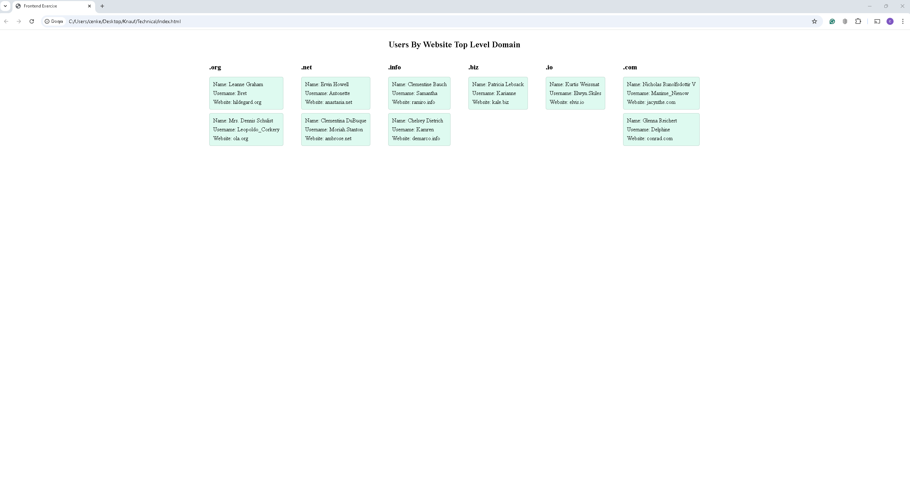

# Knauf Digital Frontend Exercise

## Getting Started

These instructions will get you a copy of the project up and running on your local machine.

### Prerequisites

Web browser for executing the code (Chrome, Firefox, Microsoft Edge).

### Installing

Please download the files from the GitHub repository.

## How to run

1) Unzip files into a single folder of your choice.
2) Open index.html with your browser.
3) Now you are ready to use.

## Results

## Authors

Cenker Karaörs
